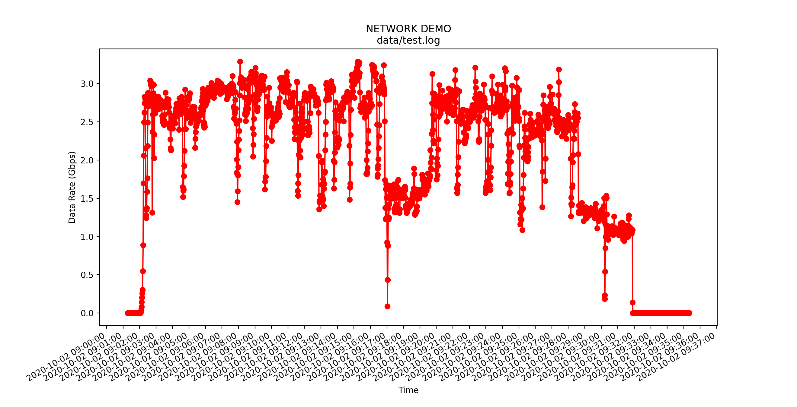

# Shao_plot_dstat : plot dstat logfile

shao_plot_dstat is a package for plotting the logfile record by dstat command.

## Installation

There are two methods to install shao-plot-dstat

### CONDA

```bash
$ git clone https://github.com/shaoguangleo/shao-plot-dstat.git
$ cd shao-plot-dstat
$ conda env create -f environment.yaml
```

## pip

```bash
$ git clone https://github.com/shaoguangleo/shao-plot-dstat.git
$ cd shao-plot-dstat
$ pip3 install -r requirements.txt
```


## Usage

Just type

```bash
$ python3 plotdstat/plot_dstat.py --logfile logfile --title TITLE  --saveplot out 
```

For example:

```bash
$ python3 plotdstat/plot_dstat.py --logfile data/test.log --title 'NETWORK DEMO' --saveplot network_demo --debug
```

Then you will get the following figure name with :

- network_demo.png




## License
